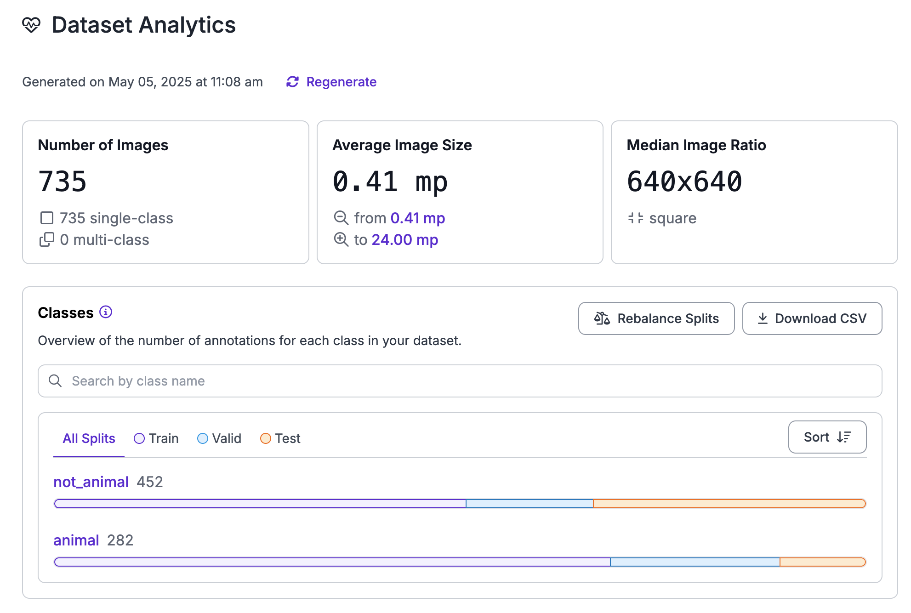

# Animal Classification
This repo provides simple example of finetuning a model to provide enhanced predictability. The goal was to classify animals from non-animals. In order to do that we used the openai/clip-vit-base-patch32 model which is very good at zero-shot classification. Meaning the model is able to predict new categories it has not seen during it's initial training.

# Setup
This repo uses poetry to manage packages.

Install Poetry
```
$ brew install poetry
```

Setup Python 3.12
```
$ brew install pyenv
$ pyenv install 3.12.0
$ poetry env use ~/.pyenv/versions/3.12.0/bin/python3
```

Install Dependencies
```
$ poetry install
```

## Initial Model Results (Zero-Shot)
Using inference we pass in several images to see how well the model can predict animals vs non-animal.

```
$ poetry run python inference.py --model original_zero_shot
```

| Image           | Prediction | Result  |
| --------------- | ---------- | ------- |
| car1            | non-animal | &#x2611 |
| car2            | animal     | &#x2612 |
| elephant        | animal     | &#x2611 |
| lion            | animal     | &#x2611 |
| city            | non-animal | &#x2611 |
| gorilla         | animal     | &#x2611 |
| panda           | non-animal | &#x2612 |
| cat             | animal     | &#x2611 |
| llama           | animal     | &#x2611 |
| pet_with_family | non-animal | &#x2612 |

As we can see the model is pretty good but not great as it got 7/10 correct. So how do we improve? The answer is fine tuning.

## Data Classification
In order to tune model we need to re-train it with additional data and then tweak model parameters until we get the desired results. I would recommend several hundred animal and non-animal images, ideally 500-1000. I used Roboflow that provided a pre-canned dataset. I simply had to classify the images. Roboflow also allows you to do valuable pre-processing, in this case making sure all images stretch to same size 640x480. Finally, it easily allows for splitting data across training set, valid set and test set.



## Fine Tuning
After some initial training I found that I needed more examples of animals (I wasn't getting the results I wanted by purely tweaking model weights), so I added my own pictures. I still only had 282 animal vs 452 non-animal pictures which isn't ideal. The point is even with a fairly limited training set I was (rather easily) able to outperform the original zero-shot model (openai/clip-vit-base-patch32). 

Optimizations
| Name               | Setting |
| ------------------ | ------- |
| Animal Weight      | 6.1     |
| Non-Animal Weight  | 2.1     |
| Epochs             | 3       |
| Batch Size         | 12      |

```
$ poetry run python finetuning.py
```

## Fine Tuning Model Results
After training fine tuned model we can test inference as compared to the original zero-shot.

```
$ poetry run python inference.py --model tuned
```


| Image           | Prediction | Result  |
| --------------- | ---------- | ------- |
| car1            | non-animal | &#x2611 |
| car2            | animal     | &#x2611 |
| elephant        | animal     | &#x2611 |
| lion            | animal     | &#x2611 |
| city            | non-animal | &#x2611 |
| gorilla         | animal     | &#x2611 |
| panda           | non-animal | &#x2611 |
| cat             | animal     | &#x2611 |
| llama           | animal     | &#x2611 |
| pet_with_family | non-animal | &#x2611 |

The results speak for themselves, our tuned model is able to successfully predict every image which shows just a little bit of tuning can go a long way to increase model accuracy and predictability.
